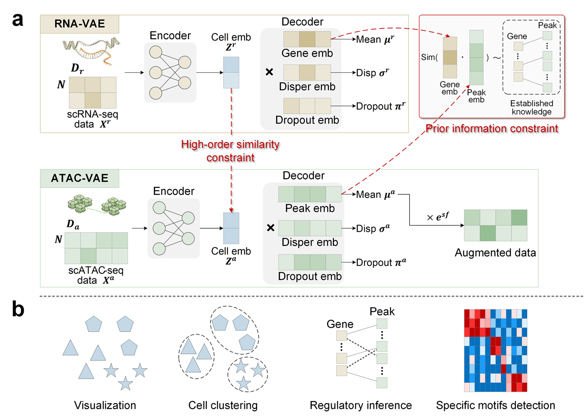

# FactVAE

## Overview
FactVAE is a novel factorized variational autoencoder proposed to comprehensively analyze ATAC and RNA data derived from the same cells. It consists of two primary VAEs: RNA-VAE for RNA data and ATAC-VAE for ATAC data. Compared to regular VAEs, FactVAE novelly introduces the factorization into VAEs. The decoders are designed to fit a matrix and multiply it with the embeddings to reconstruct the input matrix. This approach allows FactVAE to capture sample and feature information more efficiently, leveraging the VAE's ability to capture nonlinear information of samples while mitigating the loss of feature information typically encountered in VAEs. Specifically, the encoders project the original data to the latent space, capturing sample, i.e. cell, information. The decoders capture feature, i.e. gene or peak, information and reconstruct the data distribution from the latent space by multiplying feature embeddings with the cell embeddings. The resulting cell embeddings can be leveraged for downstream cell-level analyses, such as cell clustering, while the feature embeddings provide insights into potential regulatory relationships between genes and peaks. To obtain these embeddings, FactVAE is trained iteratively through two optimization processes: co-optimization of RNA-VAE and ATAC-VAE, and independent optimization of the encoder within ATAC-VAE. The co-optimization aims to capture and extract multi-omics data information by simultaneously optimizing RNA-VAE and ATAC-VAE under the guidance of established gene-peak regulatory relationships. The independent optimization, facilitated by the higher-order feature similarity constraint, encourages the encoder within ATAC-VAE, as the student model, to learn as much knowledge as possible from RNA-VAE, as the teacher model. This strategy optimizes the cell embeddings and enhances the augmentation of ATAC data, which can be used for downstream analysis, such as differential motif detection.

## Usage
1. Install the dependency packages in requirements.txt.  
2. Run run_FactVAE.py
